# 🎨 小学生必备：40种高效学习方法完全指南

> 专为小学4-6年级同学设计的学习方法大全，按五大类别系统整理。
> 每种方法都配有**AI生成的信息图**，图文并茂，一看就懂！
>
> 🌐 在线互动版：[学习的魔法之旅](https://jianghao.wang/little-learning-magic/)

---

## 📂 五大分类总览

| 分类 | 方法数量 | 一句话 |
|------|:--:|------|
| ⏰ 时间与任务管理 | 7 | 学会管理时间，做事不拖拉 |
| 🧠 记忆强化技巧 | 8 | 记得快又牢，考试不慌张 |
| 💡 深度理解方法 | 9 | 不只是记住，还要真懂 |
| 🤝 互动与激励 | 6 | 一起学更有动力 |
| 🌈 情绪与习惯 | 10 | 好状态才有好学习 |

---

---

## ⏰ 时间与任务管理

### 01. 🍅 番茄专注法

> 25分钟专注 + 5分钟休息，让注意力像激光一样集中

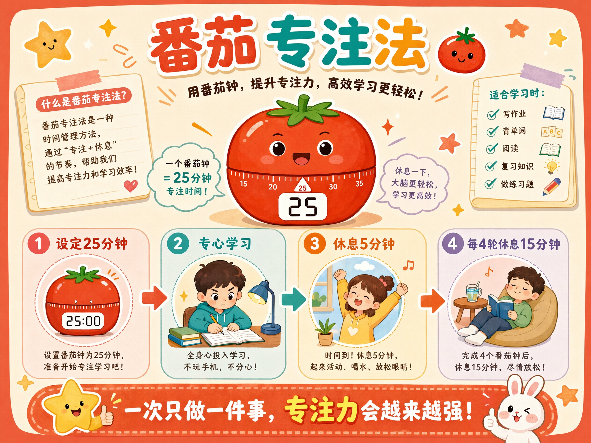

**📖 这是什么？**

把学习时间切成「番茄钟」：专注学习25分钟，然后休息5分钟。每完成4个番茄钟，就休息15-30分钟。一次只做一件事，效率翻倍！

**🧠 为什么有效？**

小学生的注意力大约能集中20-30分钟。番茄法正好配合大脑的注意力节奏，让你在最佳状态下学习，累了就休息，起来活动一下再继续。

**✨ 魔法咒语**

> "让爸爸妈妈帮你用手机设一个25分钟的闹钟，响铃之前只做一件事，像进入了专注结界一样！"

### 02. 📅 间隔记忆法

> 像浇花一样复习，不多不少刚刚好，知识越记越牢

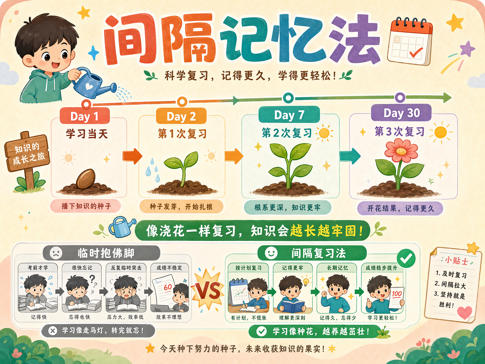

**📖 这是什么？**

不要考前临时抱佛脚！学完新知识后，在固定的时间间隔复习：当天→第二天→一周后→一个月后。每次复习的时间会越来越短，但记忆越来越深。

**🧠 为什么有效？**

大脑会忘记东西——但每次在「快要忘记」的时候复习，记忆就会变得更牢固。这就像给记忆之树浇水：不是一次浇很多，而是每隔几天浇一点。

**✨ 魔法咒语**

> "在日历上圈出复习日：📌第2天 → 📌第7天 → 📌第30天，像寻宝游戏一样期待每个复习日！"

### 03. 🪜 目标分解法

> 把大目标切成小台阶，一步一步轻松走到最高处

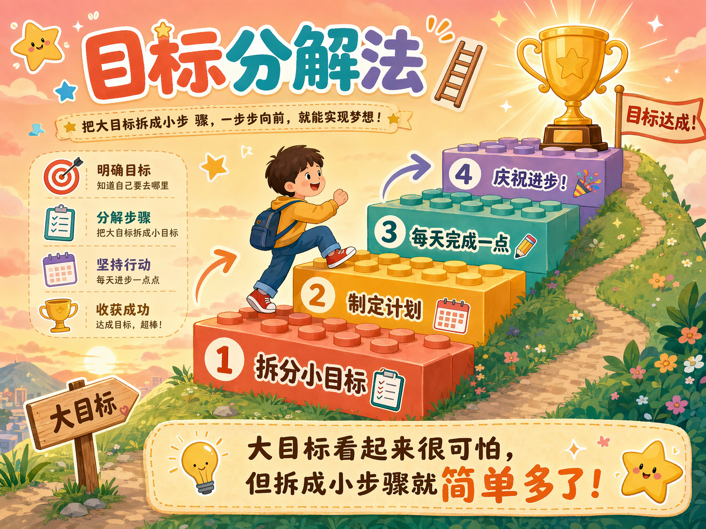

**📖 这是什么？**

面对一个大目标（比如「背完100个单词」），不要被吓到。把它拆成小步骤：每天背5个→每周复习→每月测试。每完成一步就给自己一个小奖励，不知不觉就做到了！

**🧠 为什么有效？**

大脑面对太大的任务会感到焦虑而拖延。但小步骤看起来很容易完成，完成后的成就感会激励你继续前进。这是游戏设计的原理——把大关卡拆成小关卡！

**✨ 魔法咒语**

> "把本周最大的学习任务写在纸的最上面，然后像画楼梯一样，依次写下5个你能做到的小步骤，做完一个划掉一个！"

### 04. 🟩 四象限法

> 把事情按重要和紧急分类，先做最重要的事

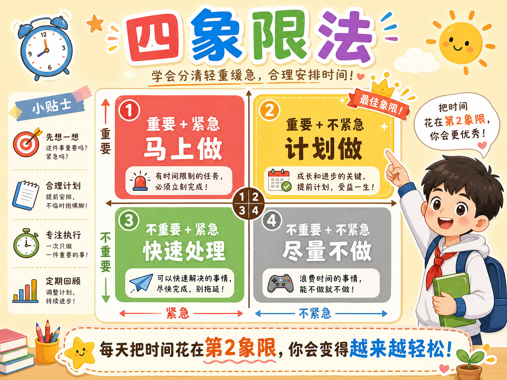

**📖 这是什么？**

画一个十字分成四格：①重要+紧急（马上做）②重要+不紧急（计划做⭐重点）③不重要+紧急（快速处理或请人帮忙）④不重要+不紧急（少做或不做）。

**🧠 为什么有效？**

很多小朋友「看起来很忙」是因为总在做第③④象限的事。把时间花在第②象限，你会越来越轻松——这就是聪明人的秘密！

**✨ 魔法咒语**

> "每天晚上花1分钟想一想：明天最重要的一件事是什么？把它写下来贴在书桌上！"

### 05. 🌅 晨间规划法

> 每天早上3分钟，列好「今日三件事」

**📖 这是什么？**

每天早上起床后，在笔记本上写下今天要完成的最重要的3件事。按顺序完成，做完一项划掉一项。

**🧠 为什么有效？**

一天没有计划就像没有地图的旅行。花3分钟规划，就能知道自己今天要做什么、先做什么——效率翻倍！

**✨ 魔法咒语**

> "准备一个晨间小本子，每天早上写下「今日三件事」。划掉时那个爽感会让你爱上规划！"

### 06. 🔄 交叉学习法

> 多科目交替穿插着学，不要一晚上只学一门

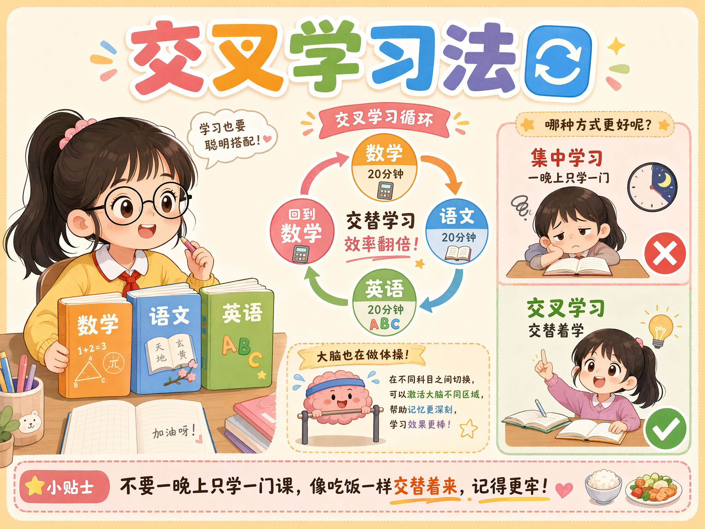

**📖 这是什么？**

不要连续2小时只学数学——把数学、语文、英语交替穿插着学。比如：20分钟数学 → 20分钟语文 → 20分钟英语 → 再回到数学。每次切换科目时，大脑被迫重新「提取」刚才的内容。

**🧠 为什么有效？**

集中学习让你产生「我已经很熟了」的错觉，但交叉学习每次切换=强制回忆=最强记忆强化。科学证明长期记忆效果是集中学习的2倍以上！

**✨ 魔法咒语**

> "今晚做作业时试试：数学20分钟→语文20分钟→英语20分钟，循环两轮，你会发现记得特别牢！"

### 07. 🧠 大脑休息法

> 专注后必须放空，灵感自然来

**📖 这是什么？**

大脑有两种模式：①专注模式（聚焦学习，像聚光灯）②发散模式（放松放空，像泛光灯）。专注40分钟后必须休息10分钟，发呆也是学习的一部分！

**🧠 为什么有效？**

发散模式下大脑在后台自动整理知识、产生新连接。很多天才灵感都来自洗澡、散步时的放空状态。不是浪费时间！

**✨ 魔法咒语**

> "学习40分钟后站起来走一走、看看窗外、喝杯水。发呆的10分钟大脑在帮你自动整理知识！"

---

## 🧠 记忆强化技巧

### 08. 🔍 预习与复习法

> 形成学习闭环，让知识牢牢扎根

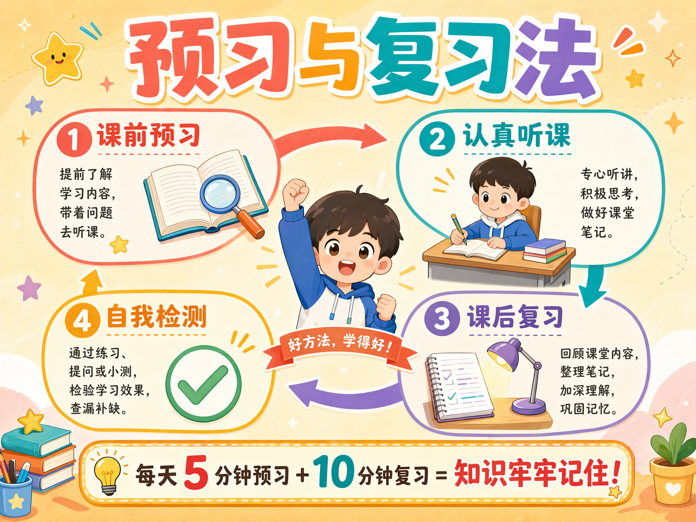

**📖 这是什么？**

预习是上课前快速浏览新内容，带着问题去听课；复习是课后及时巩固，把短期记忆变成长期记忆。两者结合形成一个完整的学习循环。

**🧠 为什么有效？**

大脑像一座图书馆，预习帮你「搭好空书架」，复习帮你「把书放对位置」。提前了解内容会让你在课堂上更容易理解老师的讲解。

**✨ 魔法咒语**

> "每天睡觉前，用3句话告诉爸爸妈妈今天学到了什么！睡前回忆是记忆的黄金时间。"

### 09. 🧩 联想记忆法

> 给枯燥的知识编一个有趣的故事，记忆从此不再困难

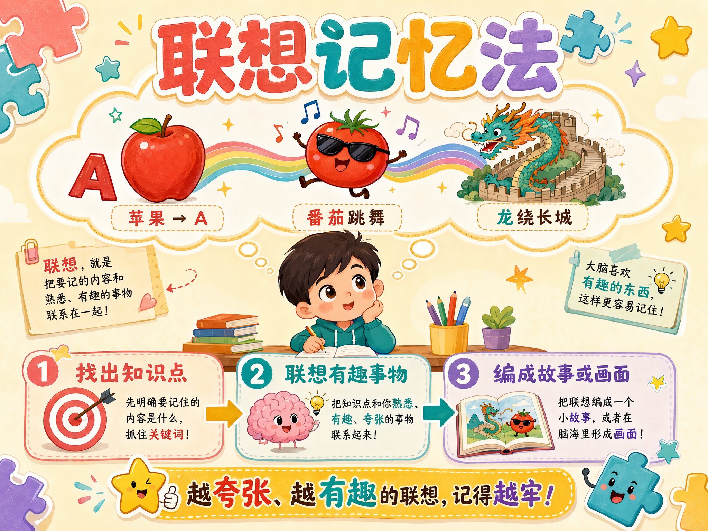

**📖 这是什么？**

把需要记忆的知识点和生活中熟悉、有趣的事物联系起来。比如记「apple」这个词，想象一个大红苹果戴着墨镜在跳disco。越是夸张、搞笑、有画面感的联想，记得越牢。

**🧠 为什么有效？**

大脑特别喜欢新奇的、有趣的、有画面感的信息。枯燥的知识容易被忘记，但有趣的故事和画面会被牢牢记住。这也是为什么我们能记住动画片的情节却记不住课本。

**✨ 魔法咒语**

> "给今天要记的5个知识点各编一句夸张的联想，越搞笑越好！比如「李白乘舟将欲行，突然想吃冰淇淋」。"

### 10. 🗺️ 思维导图法

> 用画图的方式整理知识，把零散的信息变成一棵知识大树

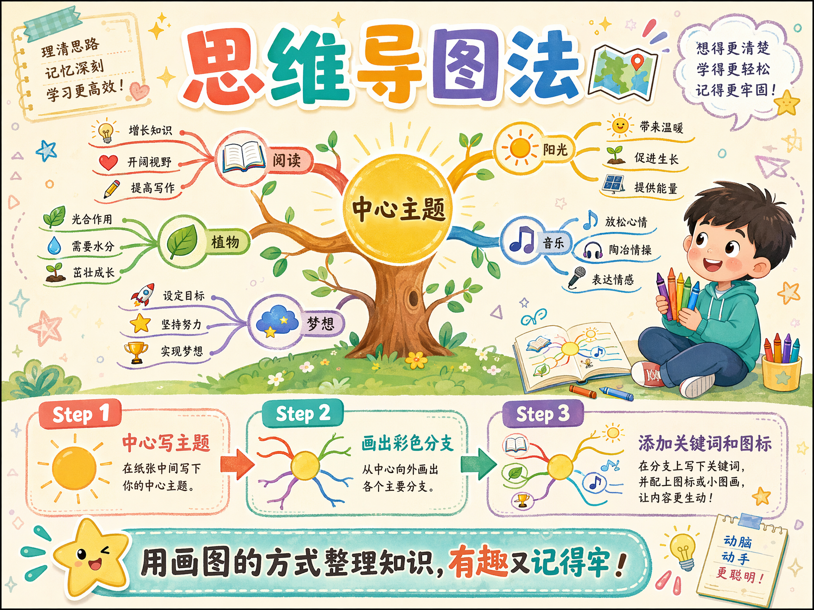

**📖 这是什么？**

在一张大白纸的中心写下主题，然后用彩色线条向外画出分支。每个分支代表一个大知识点，再在分支上添加关键词和小图标。这就像在画一棵知识树！

**🧠 为什么有效？**

大脑天生喜欢图像和颜色，讨厌长长的文字。思维导图把文字变成了画面，左右脑一起工作，理解和记忆效果都大大提升。

**✨ 魔法咒语**

> "用不同颜色的彩笔来画思维导图，红色标重点、蓝色写定义、绿色举例子，像画画一样整理知识！"

### 11. 🧱 组块记忆法

> 把零散信息打包成块，一次记住更多

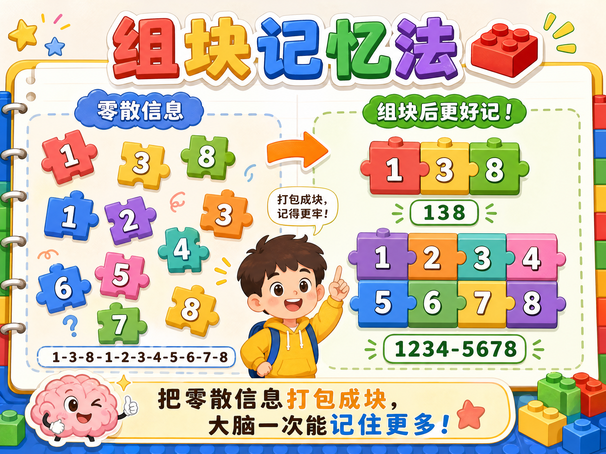

**📖 这是什么？**

把零散的信息打包成有意义的「块」。比如记手机号「138-1234-5678」是3个块而非11个数字。背课文也按段落分块来记。

**🧠 为什么有效？**

人脑一次只能记住4-7个独立信息。但组块后，每个块只占一个「槽位」，原来只能记7个数字，组块后能记7组信息！

**✨ 魔法咒语**

> "背长课文时先分3-4个段落块，一块一块地记，最后串起来，比整篇硬背轻松10倍！"

### 12. 🌙 睡前复习法

> 睡前15分钟是记忆的黄金窗口

**📖 这是什么？**

睡觉前花15分钟快速过一遍今天学的内容。然后安心入睡——大脑会在你睡觉时自动整理和巩固这些知识。

**🧠 为什么有效？**

睡眠期间，大脑海马体会自动「重播」白天学过的内容。睡前复习相当于给你的大脑下达「这个很重要，请保存」的指令！

**✨ 魔法咒语**

> "把课本放在床头，睡前翻10分钟，然后对自己说「大脑大脑，帮我记住这些」——你睡着后大脑真的会加班！"

### 13. 🎨 双编码法

> 文字+图像两条路，记住同一个知识

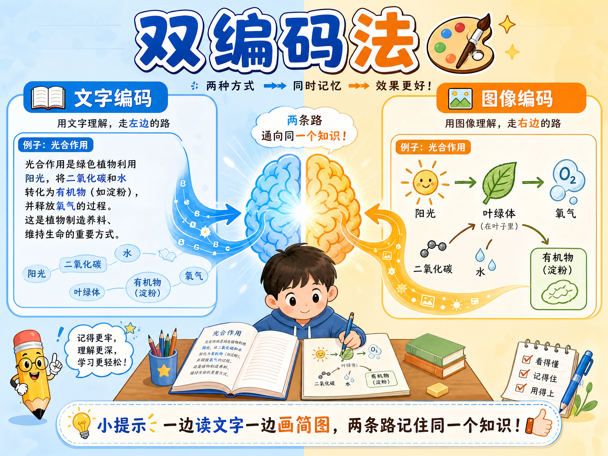

**📖 这是什么？**

每学一个新概念，一边读文字一边画简图。比如学「水的循环」，文字描述的同时画一个太阳→蒸发→云→下雨的循环图。

**🧠 为什么有效？**

大脑有两条记忆通路：语言文字和视觉图像。用两路同时编码，忘记文字时图像还能提醒你——相当于双重保险！

**✨ 魔法咒语**

> "每学一个新概念就画一个简笔画在旁边，哪怕只是火柴人！画出来 = 记住它的第二条路。"

### 14. 🌉 类比桥梁法

> 用熟悉的事物类比陌生的概念，理解快10倍

**📖 这是什么？**

用熟悉的事物类比陌生的概念。比如学电流 → 「电流就像水流，电压像水压，电阻像水管粗细」。找到新旧知识之间的共同规律。

**🧠 为什么有效？**

类比是人类最强大的思维工具。所有重大科学发现（DNA双螺旋、原子模型）都始于类比。用已知解释未知，理解快10倍！

**✨ 魔法咒语**

> "遇到难懂的概念问自己：这个东西像什么我已经知道的？用你最熟悉的东西来比喻它！"

### 15. 👀 多感官学习法

> 眼看+耳听+手写+口读，四管齐下记得牢

**📖 这是什么？**

同时调动多个感官学习：👀眼看（阅读）、👂耳听（朗读/听讲）、✍️手写（记笔记）、🗣️口读（说出来）。四种感官一起上，记住80%以上！

**🧠 为什么有效？**

只用眼睛看只能记住20%。但多感官协同时，大脑建立了多条提取路径——一条忘了，其他还能帮你回忆。

**✨ 魔法咒语**

> "背单词时同时做到：眼看拼写、大声读出来、用手写一遍、耳朵听自己的发音——四管齐下记得最牢！"

---

## 💡 深度理解方法

### 16. 👨‍🏫 费曼小老师法

> 把学到的知识讲出来，讲得清楚才算真的会了

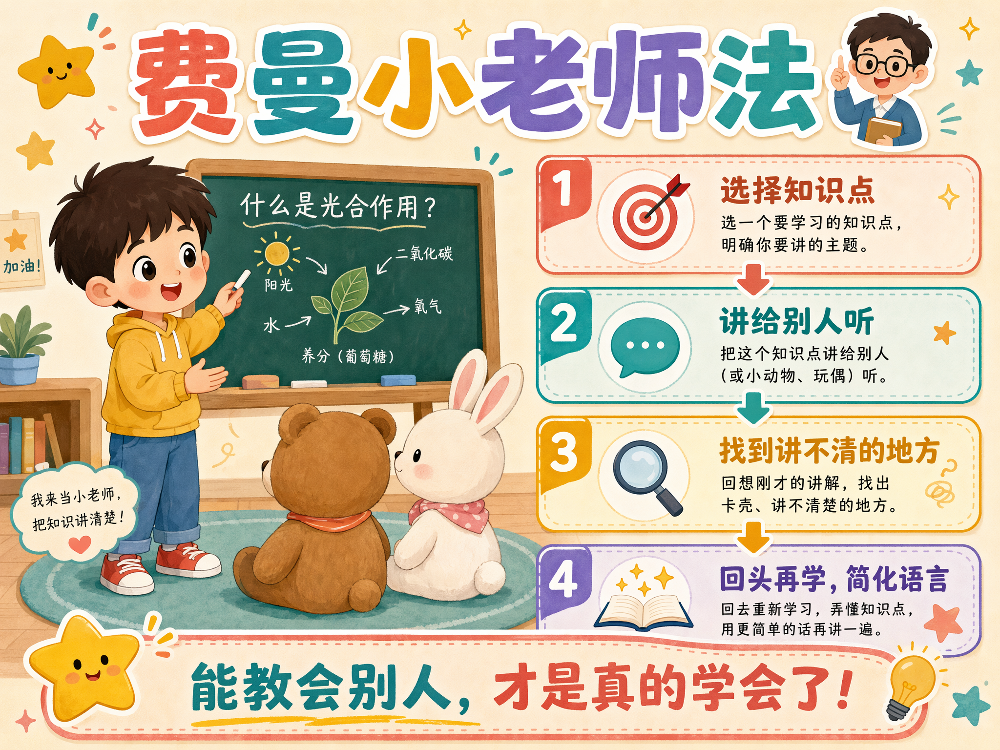

**📖 这是什么？**

假装自己是小老师，把刚学的知识讲给毛绒玩具、宠物或者家人听。用最简单的语言讲清楚——如果讲着讲着卡住了，那个地方就是你需要再去学的地方！

**🧠 为什么有效？**

听懂了 ≠ 学会了。只有能用简单的话把知识讲清楚，才说明大脑真正理解并组织了这些知识。这是诺贝尔奖得主费曼的学习秘诀！

**✨ 魔法咒语**

> "今天学到的知识，试着用最简单的话教给你的玩偶小熊吧！讲不通的地方就是你要重新学习的宝藏。"

### 17. ❓ 提问学习法

> 带着「为什么」去学习，好奇心是最好的老师

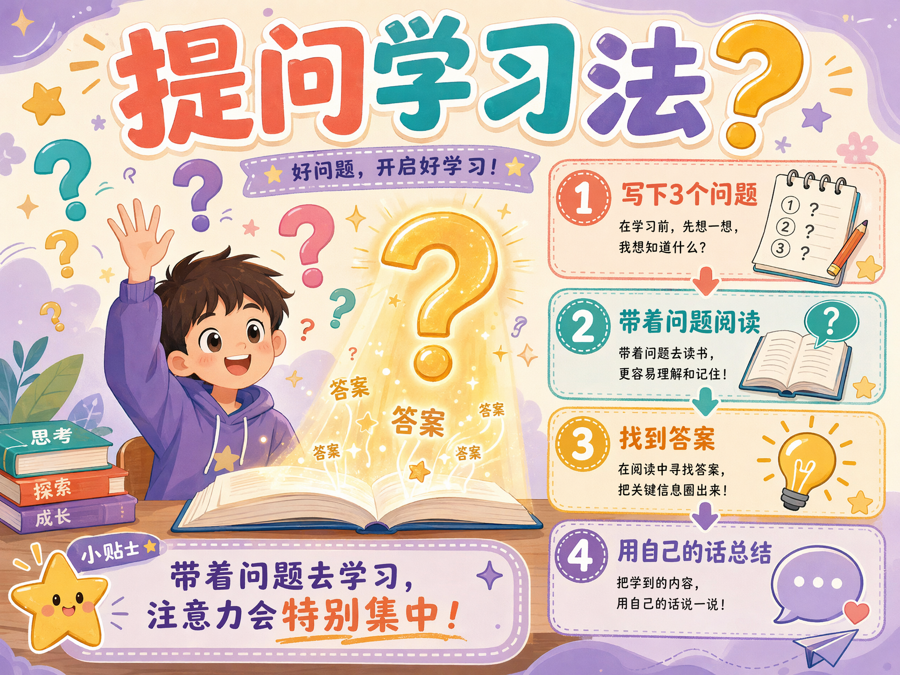

**📖 这是什么？**

在开始学习新课之前，先写下你最想知道的3个问题。然后带着这些问题去阅读、听课，像侦探一样寻找答案。找到答案后，用自己的话总结出来。

**🧠 为什么有效？**

有问题的大脑就像一个磁铁，会自动吸引相关信息。当你带着具体问题去学习时，注意力会大幅提升，因为你有了明确的目标——找到答案！

**✨ 魔法咒语**

> "每次学新课前，像一个小记者一样在纸上写下3个「为什么」，然后带着它们去找答案吧！"

### 18. ✅ 自我检测法

> 学完后考考自己，能回忆出来的知识才是真正属于你的

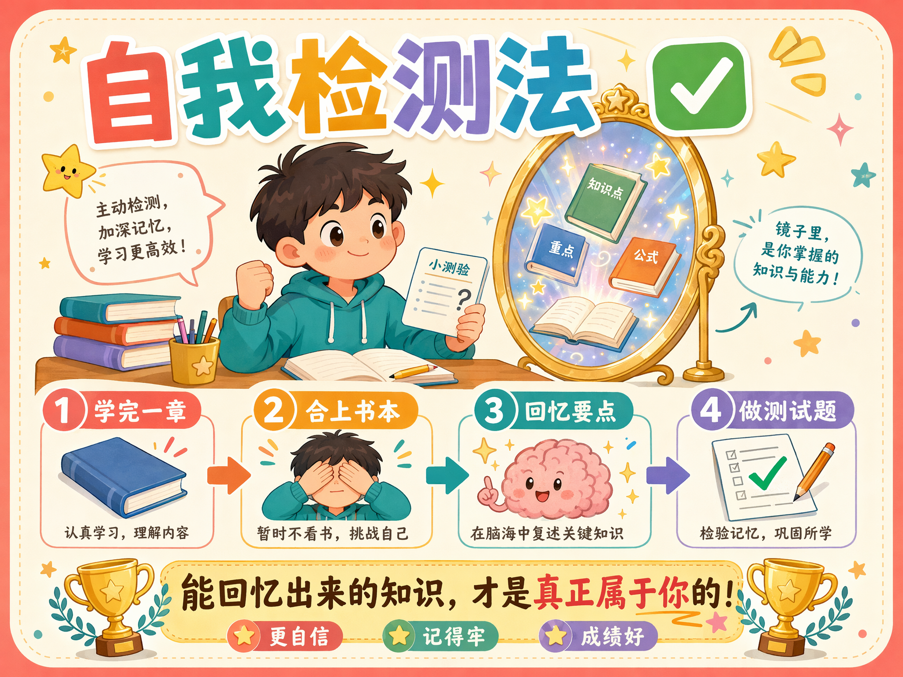

**📖 这是什么？**

学完一个知识点后，不要只是「再看一遍」。合上书本，闭上眼睛，尝试回忆主要内容。然后做几道练习题来检测。发现不会的地方，立刻回去重新学习。

**🧠 为什么有效？**

重读课本会让你产生「我已经会了」的错觉，但回忆才是真正的记忆提取练习。每次成功回忆，大脑中的记忆通路就会加强一次。检测不是为了打分，而是为了找到学习盲区！

**✨ 魔法咒语**

> "每学完一课，合上书本，拿出一张白纸，写下你能回忆出的所有要点。然后打开书对照，用彩色笔补上忘记的内容！"

### 19. 📝 康奈尔笔记法

> 把一页笔记分成三区，整理+复习一次搞定

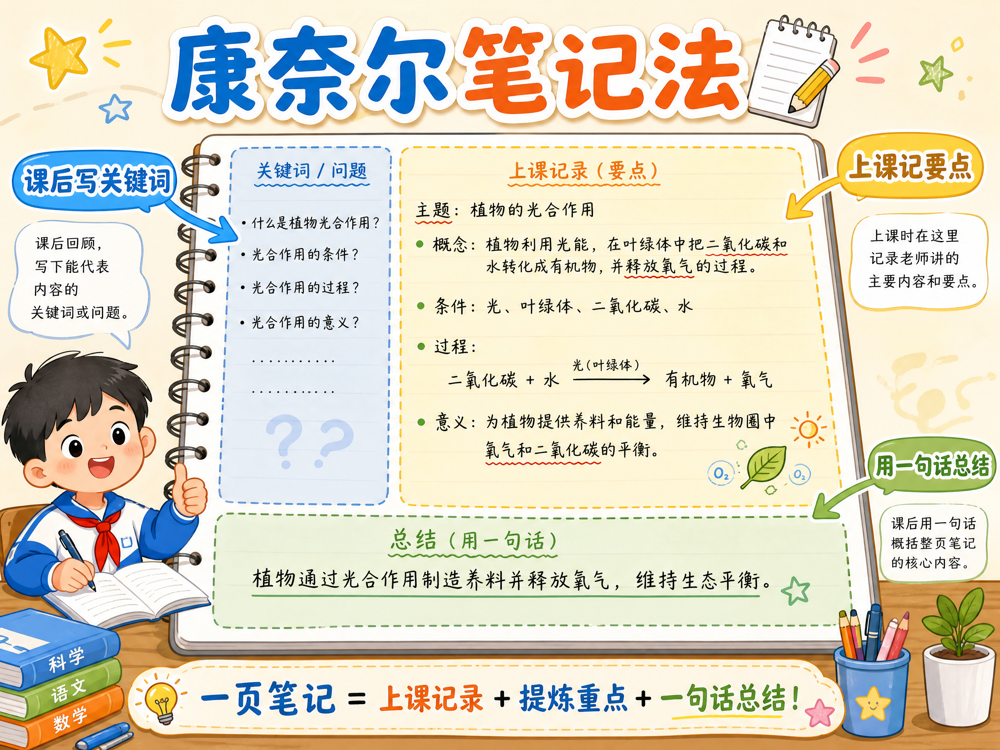

**📖 这是什么？**

把笔记页分成三个区域：右边（大区）上课记要点；左边（窄条）课后提炼关键词和问题；底部用一句话总结整页内容。

**🧠 为什么有效？**

结构化笔记本身就是复习提纲。复习时遮住右边看左边关键词，试着回忆内容——既是笔记又是自测工具！

**✨ 魔法咒语**

> "把笔记本页面画两条线分成三区：左边写关键词、右边记笔记、底部一句话总结！"

### 20. 🔄 SQ3R阅读法

> 五步系统阅读，把一本书真正读懂

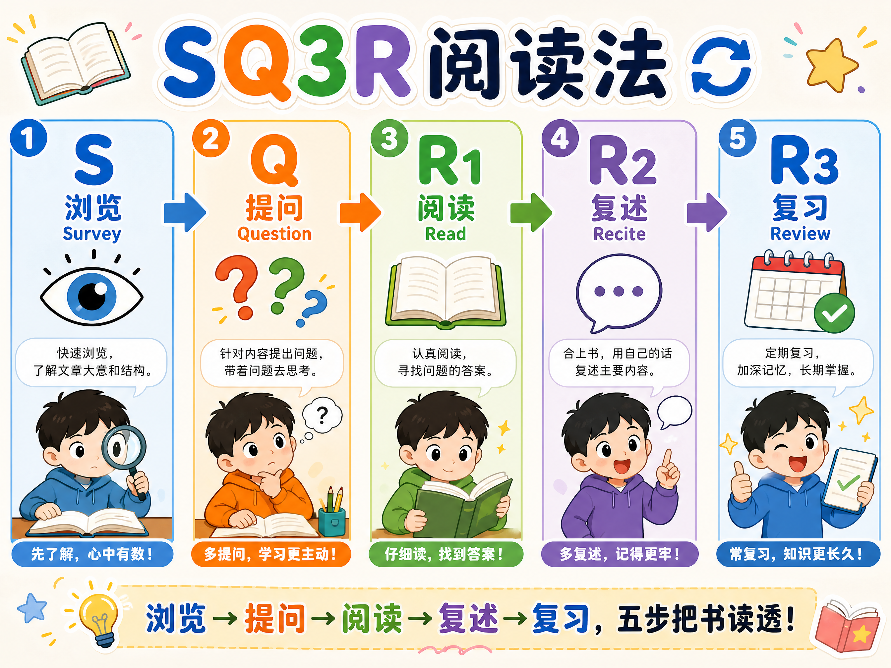

**📖 这是什么？**

S=浏览（看标题图片）→ Q=提问（写下3个问题）→ R1=阅读（带着问题读）→ R2=复述（合上书说一遍）→ R3=复习（过几天再看）。

**🧠 为什么有效？**

被动阅读只能记住10%，但加上提问和复述后，记忆留存率提升到90%！五步法把被动翻书变成主动探索。

**✨ 魔法咒语**

> "读课文前先翻一遍标题和图片，猜猜这篇文章讲什么。带着猜想读，比直接读有趣10倍！"

### 21. 🔗 精细加工法

> 学新知识时主动问「和什么有关」，把新知识粘到旧知识上

**📖 这是什么？**

学新知识时主动问自己：这和我之前学的有什么联系？为什么会这样？如果…会怎样？把孤立的新知识通过问题连接到已有的知识网上。

**🧠 为什么有效？**

孤立的知识1周后忘记70%，但与已有知识建立3个以上连接后，遗忘率降到10%。连接越多，记得越牢！

**✨ 魔法咒语**

> "学新知识时主动问3个「和什么有关」——把新知识粘到旧知识上，它们就永远不会分开了！"

### 22. 🪜 具体例子法

> 每个抽象概念找3个生活中的例子，知识就活起来了

**📖 这是什么？**

学抽象概念时，自己找3个生活中的例子。比如学「对称」→ 蝴蝶翅膀、人脸、折纸。例子越多越具体，理解越深入。

**🧠 为什么有效？**

人类大脑理解抽象概念的神经基础是「复用」具体经验的脑区。光看定义很难理解，3个例子胜过100遍死记！

**✨ 魔法咒语**

> "每个抽象概念找3个生活中的例子，画下来或写下来。知识就活起来了，不再是书本上的死文字！"

### 23. 👂 主动倾听法

> 课堂上像侦探一样听讲，效率翻3倍

**📖 这是什么？**

课堂上用三步法听讲：①预测（老师接下来会讲什么？）②抓关键词（用关键词快速记笔记）③提问（有疑问立刻标记）。像侦探一样主动捕捉信息。

**🧠 为什么有效？**

被动听讲只能吸收20-30%。主动预测+抓重点+提问，吸收率提升到70%以上。这是学霸和普通学生的本质区别！

**✨ 魔法咒语**

> "上课前猜一猜今天老师会讲什么，上课时像侦探一样验证你的猜想——听课变成了寻宝游戏！"

### 24. 🧵 知识串珠法

> 把不同学科的知识串成项链，跨学科理解

**📖 这是什么？**

不同学科的知识不是孤岛！数学的对称=美术的对称=自然的对称；语文的节奏=音乐的节拍=体育的步伐。找到不同学科之间的共同规律。

**🧠 为什么有效？**

大脑以网络方式存储知识。当你把不同学科的知识串起来时，它们互相强化——一个领域的理解会加深另一个领域！

**✨ 魔法咒语**

> "每学完一个知识点想一想：这个在其他学科里有没有类似的东西？找到规律你就跨学科了！"

---

## 🤝 互动与激励

### 25. 💎 错题宝藏法

> 每一道错题都是一颗宝石，收集它们就是收集进步

**📖 这是什么？**

准备一个专门的「错题本」，把做错的题目抄下来。关键是：分析为什么错了、写出正确的解法、标注需要注意的地方。每周翻看一次，确保同样的错误不再犯。

**🧠 为什么有效？**

做对的题目你不会进步，做错的题目才是成长的机会！大脑从错误中学习的效率是从成功中学习的3倍。错题本就是你的「进步路线图」。

**✨ 魔法咒语**

> "准备一个漂亮的笔记本作为专属「错题宝藏盒」，每道错题分三栏：错题→正确解法→我为什么会错。"

### 26. 🤝 合作学习法

> 找一个学习伙伴，互相讲给对方听，记得最牢

**📖 这是什么？**

找一个同学或朋友当「学习伙伴」。互相讲解知识点、互相提问、互相批改作业。轮流当小老师，看谁讲得更清楚！

**🧠 为什么有效？**

学习金字塔理论：听讲只能记住5%，但教给别人能记住90%！两个人一起学，不仅更开心，效果也好得多。

**✨ 魔法咒语**

> "和好朋友约定每周一次「小老师对决」，讲同一个知识点看谁更清楚。赢了的人请吃一块糖！"

### 27. 🏆 游戏化学习法

> 把学习设计成闯关游戏，每完成一关都有成就感

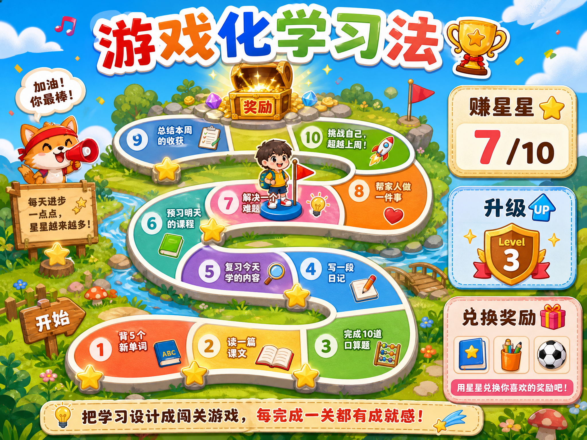

**📖 这是什么？**

画一张「学习闯关地图」，每完成一个任务前进一格。攒够10颗星兑换一个小奖励。把枯燥的学习变成像打游戏一样有趣！

**🧠 为什么有效？**

大脑对游戏的奖励系统和学习用的同一套回路。设定关卡→完成→获得奖励，这个循环让大脑源源不断产生动力和快乐！

**✨ 魔法咒语**

> "画一张闯关地图贴在墙上，10个关卡对应10个学习任务。每完成一关贴一颗星星，集齐兑换冰淇淋！"

### 28. 🎯 刻意练习法

> 不要只做会的题——专攻你的弱项

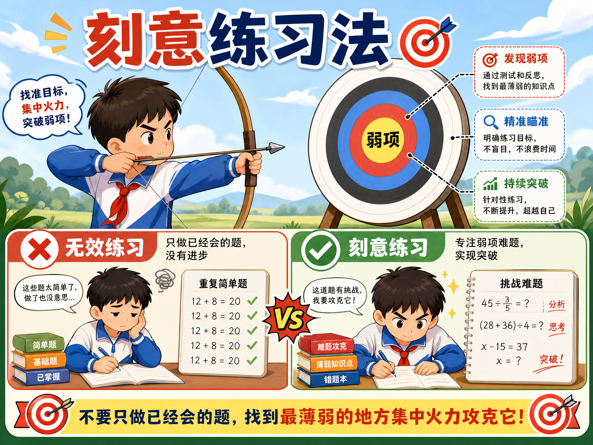

**📖 这是什么？**

找出自己最薄弱的知识点，集中火力反复练习。不是简单重复已经会的，而是不断挑战自己还不会的。瞄准「有点难但能做出来」的难度。

**🧠 为什么有效？**

花1小时攻克弱项 > 花3小时做已经会的题。大脑在「有点难但能做出来」的区域学习效率最高——这叫「学习区」原理。

**✨ 魔法咒语**

> "每次做练习时问自己：这部分我做对了吗？没做对的才是今天要重点练习的！做10道简单题不如攻克1道难题。"

### 29. 🎭 角色扮演法

> 假装你是科学家、诗人或数学家来思考

**📖 这是什么？**

学习时换一个角色思考：「如果我是数学家会怎么解这道题？」「如果我是李白会怎么写这首诗？」「如果是科学家会怎么观察？」换个角色，思路大开！

**🧠 为什么有效？**

角色扮演激活大脑中不同的神经网络。当你站在不同角度看问题时，往往能发现平常发现不了的答案——这就是创造力的来源！

**✨ 魔法咒语**

> "做一道难题时假装你是老师，要给学生讲清楚。你会发现自己突然有了新的理解！"

### 30. 📋 考试策略法

> 会学也要会考：先浏览→先易后难→分好时间→留空检查

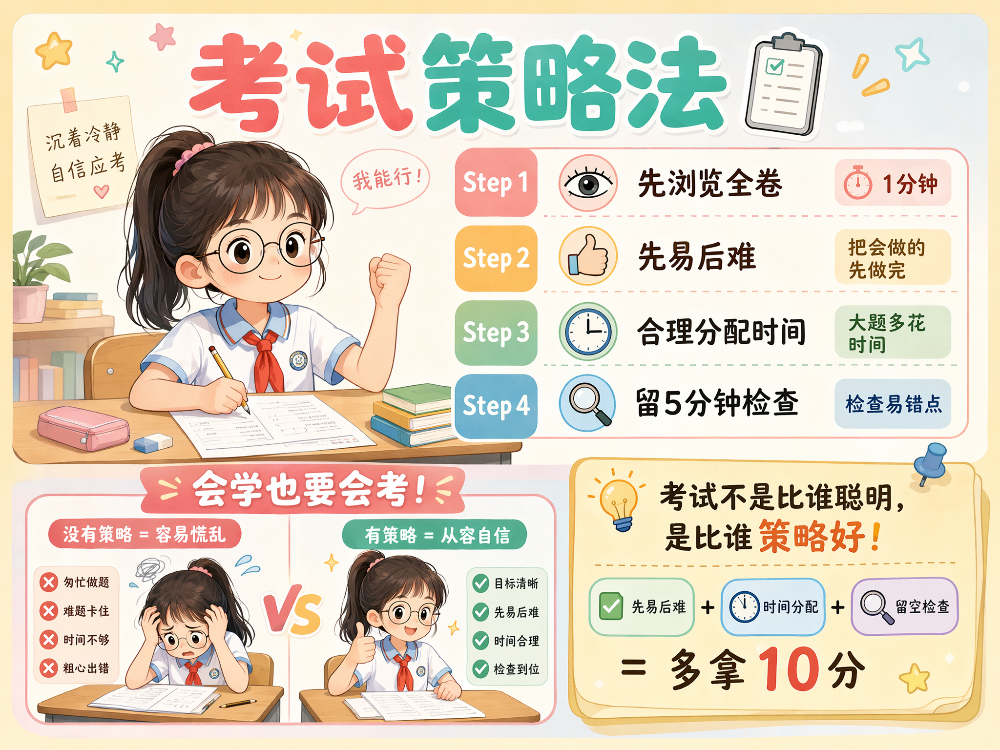

**📖 这是什么？**

考试有策略：①先浏览全卷（1分钟）②先易后难（把会做的先做完）③合理分配时间（大题多花时间）④留5分钟检查。这不是取巧，是科学应考！

**🧠 为什么有效？**

考试成绩 = 知识储备 × 考试策略。很多小朋友知识储备够但策略不对导致发挥失常。好的考试策略能让你多拿10分！

**✨ 魔法咒语**

> "考试记住口诀：先浏览→先易后难→分好时间→留空检查。最重要的是先把会做的全部做完！"

---

## 🌈 情绪与习惯

### 31. 🧘 正念学习法

> 学习前做1分钟深呼吸，清空杂念再开始

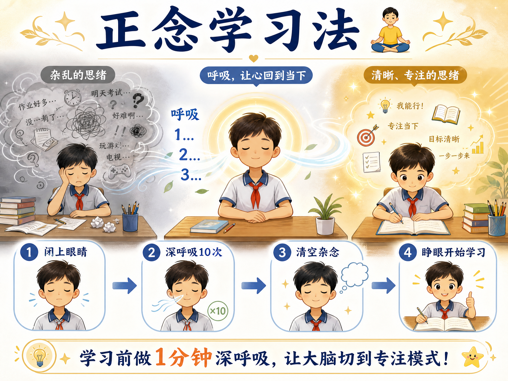

**📖 这是什么？**

开始学习前，先闭眼做10次深呼吸。只关注呼吸的起伏，把脑中杂念像云一样轻轻推开。然后睁开眼睛，带着平静的心开始学习。

**🧠 为什么有效？**

大脑从「β波」（紧张焦虑）切换到「α波」（放松专注），学习效率最高。1分钟深呼吸就像按下大脑的「重置」按钮。

**✨ 魔法咒语**

> "学习前闭眼数10次呼吸，只感受吸气~呼气~。然后对自己说「准备好了！」——大脑就切到专注模式。"

### 32. 🪞 自我对话法

> 做题时把思路说出来，正确率提升30%

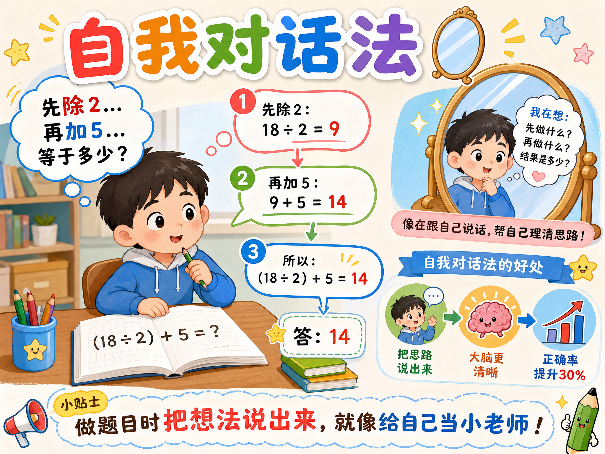

**📖 这是什么？**

做题目时自言自语，把思考过程说出来：「这个数先除2，然后加5，等于…」就像给自己当实时小老师。

**🧠 为什么有效？**

语言化迫使大脑把模糊的思维变得清晰。研究发现，把解题思路说出来能提升30%正确率！说不清楚的地方=你还没真正理解的地方。

**✨ 魔法咒语**

> "做数学题时小声把每一步说出来，就像在给自己讲解。你会发现以前模糊的地方突然变清晰了！"

### 33. 📍 固定学习角法

> 整理一个专属学习角落，坐下就自动进入状态

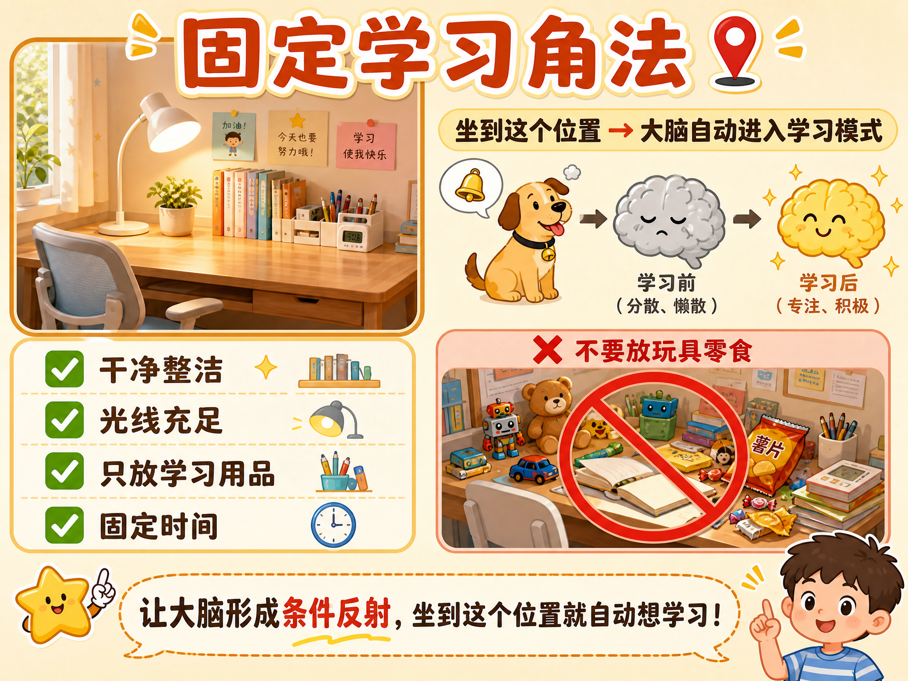

**📖 这是什么？**

在家整理一个只用于学习的固定角落：干净书桌、好灯光、学习用品整齐摆放。不放玩具和零食。每天在同一位置学习。

**🧠 为什么有效？**

大脑会自动建立「位置-行为」关联（条件反射）。就像一进厕所就想刷牙，坐到你专属的学习角，大脑自动切换到「我要学习」模式。

**✨ 魔法咒语**

> "收拾一个只用来学习的桌子角落，贴上「学习魔法区」标签。坐到这个位置，你就变成了学习小超人！"

### 34. ⏳ 碎片时间利用法

> 口袋卡片随身带，零碎时间变成黄金

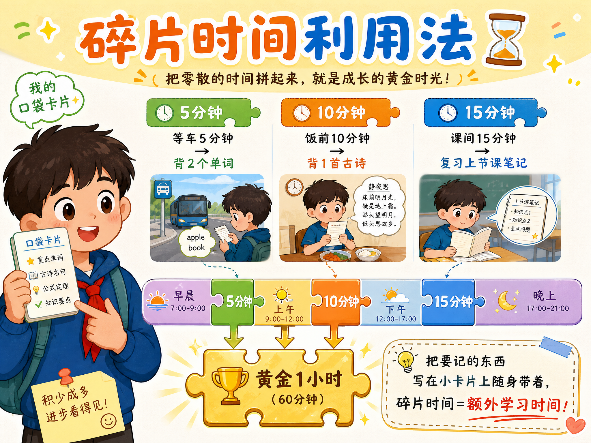

**📖 这是什么？**

把等车、排队、饭前等零碎时间利用起来。准备一张「口袋卡片」，上面写着本周要背的单词或古诗，随时拿出来看一眼。

**🧠 为什么有效？**

每天的碎片时间加起来超过1小时！积少成多，每天用碎片时间背2个单词，一年就是730个——这比很多课本的词汇量都大！

**✨ 魔法咒语**

> "做一张小卡片写5个要记的知识点，放进口袋。等车、排队、饭前各看一遍，一天轻轻松松多学5个知识点！"

### 35. 📓 反思日记法

> 每天5分钟写三句话，从被动学变成主动管

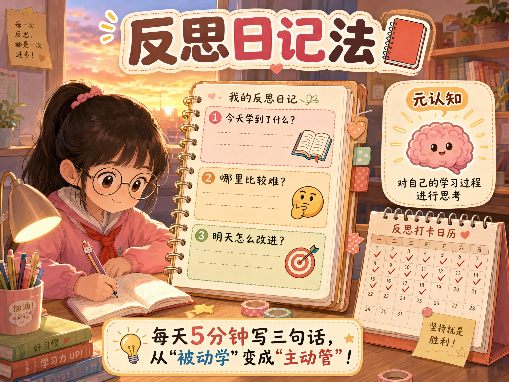

**📖 这是什么？**

每天花5分钟写三句话：①今天学到了什么？②哪里学得比较难？③明天怎么改进？从「被动学」变成「主动管」——这就是元认知。

**🧠 为什么有效？**

对自己思考过程的思考（元认知）是预测学业成绩的最强指标之一。反思帮你发现自己的学习规律，越学越聪明！

**✨ 魔法咒语**

> "准备一个小日记本，每天睡前写三句话：今天学了什么？哪里难？明天怎么改？坚持一周你就能发现自己的学习秘密！"

### 36. 🌱 成长心态法

> 把「我做不到」改成「我还做不到」——多一个字，多无限可能

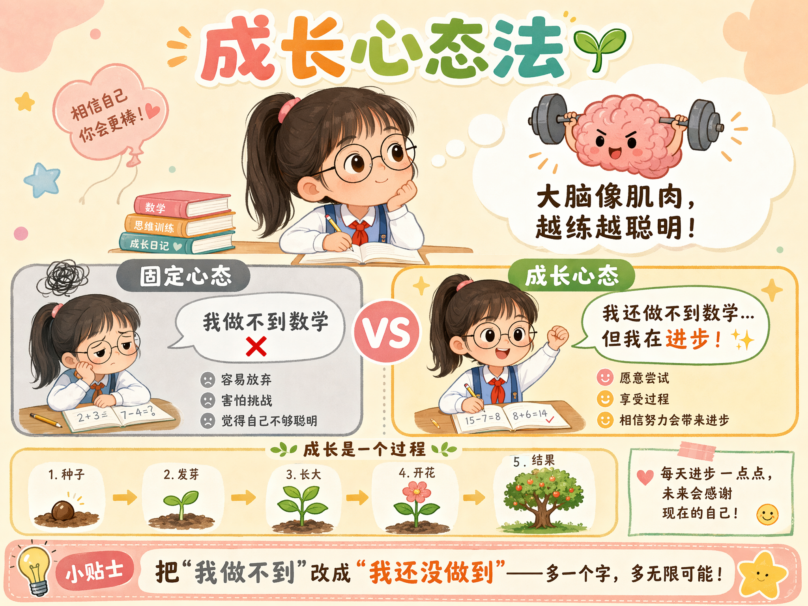

**📖 这是什么？**

相信大脑像肌肉一样，越练越聪明。把「这次我没考好」改成「这次我没考好，但我可以更努力」。面对困难时不放弃，因为每一次努力都在让大脑变强。

**🧠 为什么有效？**

斯坦福大学30年研究发现：相信智力可成长的学生，面对困难时坚持时间延长2倍，最终成绩更高。一句话改变一生！

**✨ 魔法咒语**

> "从现在开始把「我不会」改成「我还不会，但我在学」。多一个字，多无限可能！每次犯错都是大脑在长肌肉。"

### 37. 🏃 运动促学法

> 学习前先运动20分钟，大脑像升级了CPU

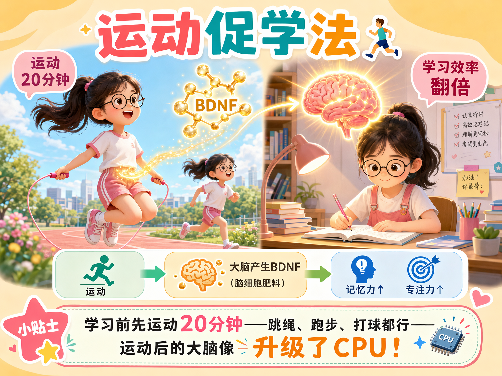

**📖 这是什么？**

学习前先运动20分钟——跳绳、跑步、打球都行。运动后大脑产生BDNF（脑细胞生长因子），记忆力和专注力都大幅提升！

**🧠 为什么有效？**

BDNF被称为大脑的「奇迹肥料」，让神经元生长新连接。运动后学习效率相当于大脑升级了CPU！这是最天然、最有效的提效方法。

**✨ 魔法咒语**

> "做作业前先跳绳或跑步20分钟，你会发现自己背东西特别快，做题也特别清醒！运动=给大脑加油。"

### 38. 🔗 习惯叠加法

> 把新学习习惯「挂」到已有的习惯上，不靠意志力靠惯性

**📖 这是什么？**

不靠意志力靠惯性！公式：在[现有习惯]之后，我会[新学习习惯]。比如：刷牙后→背1个单词、吃饭前→看1页书、睡觉前→写反思日记、放学回家→先复习10分钟。

**🧠 为什么有效？**

意志力有限但习惯无限。当新行为附着在老习惯上时，不需要额外努力——大脑自动执行。这是最省力的习惯养成方法！

**✨ 魔法咒语**

> "用这个公式：在[现有习惯]之后我会[新学习习惯]。比如：刷牙后我会背1个单词。试一周看看有多轻松！"

### 39. 🌊 心流学习法

> 找到难度刚好的「甜蜜点」，学习变成享受

**📖 这是什么？**

太简单的任务无聊，太难的焦虑。找到那个「有点难但能做出来」的甜蜜点——你会完全沉浸在学习中，忘记时间飞逝。这就是心流状态。

**🧠 为什么有效？**

心流是心理学家发现的最佳体验状态。在心流中学1小时=普通状态学3小时。关键是持续调整难度，始终保持在甜蜜区！

**✨ 魔法咒语**

> "做题目时如果觉得太简单就加难度，太难就降难度。保持在做对70%刚好有点挑战的水平，你就进入了心流！"

### 40. ✍️ 手写优势法

> 重要的知识一定要手写——记忆深度是打字的3倍

**📖 这是什么？**

重要的知识一定要手写！打字太快大脑来不及深度加工，手写时大脑被迫提炼总结。研究发现手写的记忆深度是打字的3倍。

**🧠 为什么有效？**

手写激活大脑中更大的神经网络——包括运动皮层和空间处理区域。慢就是快，少就是多。手写=大脑深度加工！

**✨ 魔法咒语**

> "记重点时关掉电脑拿起笔！手写的每一个字都经过了大脑的深度加工——你会发现自己记得特别清楚。"

---

## 🌟 使用建议

1. **不用一次学完** — 40种方法很多，先选1-2个最感兴趣的，坚持用一周
2. **按分类探索** — 每个分类解决不同的问题，根据需要选择
3. **坚持21天** — 一个新习惯需要21天才能固定，给自己一点耐心
4. **和爸爸妈妈一起** — 让家人了解这些方法，他们可以帮你一起执行

---

> 用 ❤️ 为爱学习的小朋友制作 · 2026
>
> 🌐 在线互动版：[jianghao.wang/little-learning-magic/](https://jianghao.wang/little-learning-magic/)
